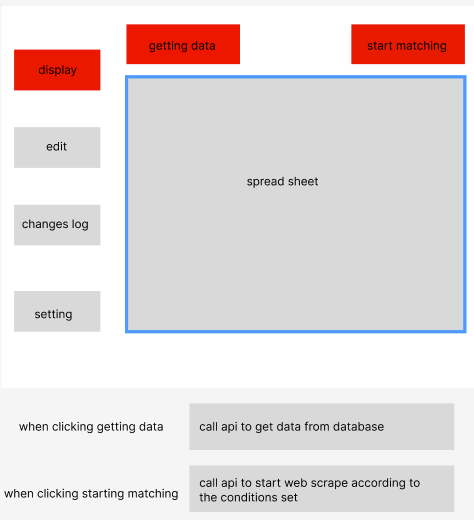

# Week 2 Meeting 30.7

Created: July 26, 2025 1:52 PM

## To do

---

- Elect 1 or 2 members for the PM role
    - Meet client representative, Melinda, at 12pm, on 31 July
- Task allocation tool

## Agenda

---

## Project Description

We maintain a database of thousands of personal contacts (each has ~8 key fields to be filled in). It requires routine cleaning which we do manually. That involves downloading sections of the data to excel and then manually googling each person one at a time. They are all people in professional, government or other leadership roles in WA and beyond. We then make updates to the excel spreadsheet if their information has changed. We use publicly available websites to ‘clean’ the data including government directories, LinkedIn and company website. All of the data sources are publicly available

## Vagueness(Interview questions)

- What’s the Minimum Viable Product of this project?
- How often do you perform this data cleansing action?
    - frequency of auto updating or adding a button for updating
- Do we need to build a solution to import cleansed Excel data into the database?
    - What’s the file format of the exported Excel file – csv or xlsx?
    - What are the 8 key fields?
        - A: extract as much info as possible
    - What database is currently being used? MySQL?
        - Where is the database stored? (Local or cloud?)
    - What specific websites do you currently use?
    - what kind of data
- What’s the specific features of data? What is the data being used for? (Clarifying this question may help us find alternative solution when one solution doesn’t work)
- Is the editing functionality compulsory or not? Whether you want a one-time cleanup + maintenance, or a **continuous sync** process.
- How many people within the company / how many concurrent users do you expect? User roles?
- Possible data sources? Google/Linkedin?
    - Is there a fixed format for searching?
- Happy with the current interface? - possibility to create a new UI.
- Any other pain points?
- Seek client’s approval regarding the use of AI in the project.
- Any branding? E.g. logos, contacts

Possible app interface—display part

possible app interface and functionality—edit part

## Functional requirements :

1. **Filter option:** Before starting matching, there will be a condition form where you can choose matching conditions, for example, set specific preference for those 8 features.
2. **Automatic data cross-check:** System automatically compares existing data fields to publicly available sources
3. **Flag discrepancies between two sources:**
    1. **Display the source URL after finishing searching** 
4. **Authentication for editing and saving changes:** what kind of staff has the access to this data or can save the changes or change it directly.
   
    -Do we need to keep the records that who did the change and save those changes 
    
5. **Changes logs:** record all changes that made before. 
6. Do you have some tech or MVP preferences on this project?
7. **Collaborative editting**

## Non-functional requirements:

**Performance:** Return matching outcomes within a specific time. 

**Security:**  Role-based authentication

**Extensibility:** System should allow for new data fields or external APIs to be integrated in the future.

**Frequency:** 

## Potential Issues

- LinkedIn profiles are partially public:
    - Profiles are restricted from access by guest users, may need API access
    - API access may require strict authorization, which can take a long time
    - Certain info is visible only to recruiter accounts
- Abuse of web crawling might lead to legal risks
- **Accuracy:** Automated updates can introduce errors; build a **review step** (e.g., “Proposed changes” tab in Excel).

### Solution 1:

A small web tool (internal) :

- upload your Excel file.
- The system fetches relevant public data (via scraping/APIs).
- It flags discrepancies for staff to approve or reject.

**Tech Stack:**

- Flask + Scrapy + Google/Bing/Linkedin API.

## MVP

- runnable demo after the first meeting with the client
- 

## Suggestions from Qin:

- make the client happy, good communication is the key to acquire high marks
- meeting F2F
- discuss the MVP with client tomorrow
- expectation management
- what support the client need
- documentation
- Jira/Trello use one of them (required)