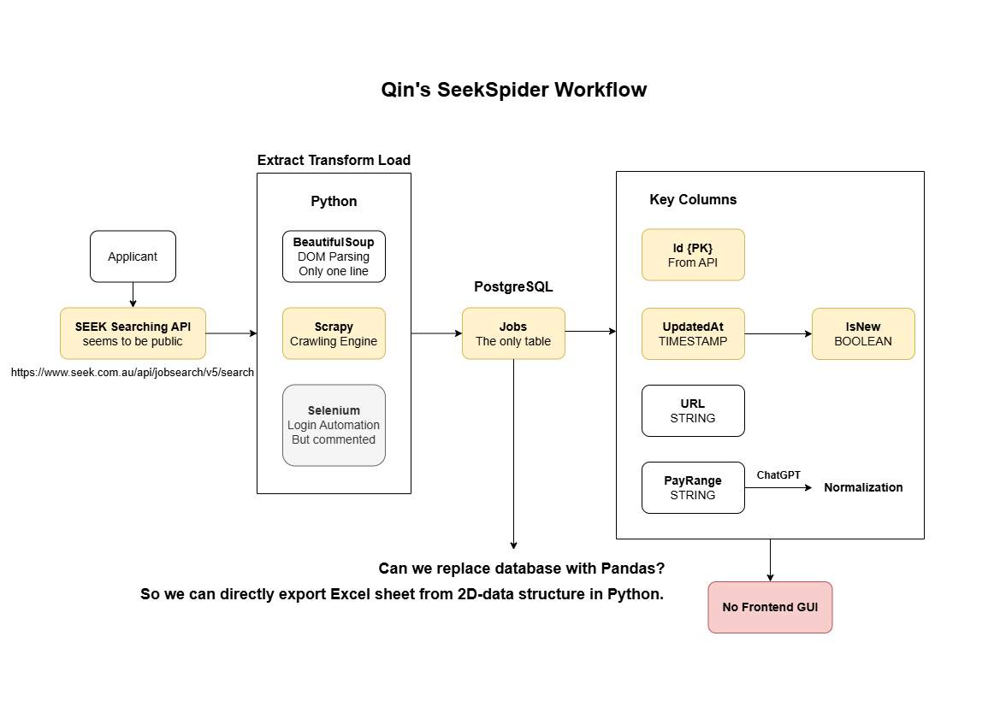

# Week 3 Meeting 5.8

Created: August 2, 2025 9:28 AM

# To do

- [x]  Implement automated LinkedIn user authentication
- [ ]  Manage to get detailed LinkedIn user profile API
- [x]  Email to Mr. Qin to book next meeting
    - Topic: the possibility of extending SeekSpider to LinkedIn
- [ ]  Break down Project Planning and start working on the first version
- [x]  Design a draft for frontend UI
    - Erica almost finished this

# Standups

(everyone say what they’ve done and sharing ideas)

### Kai (rep):

### Zihan

- 

### Jiazheng Guo:

- 

### Erica:

- Did research about scraping from linkedin. Found this https://github.com/joeyism/linkedin_scraper. It’s written in python
    - Looks like it can return everything we need (not sure about `gender`)
    - Probably need to get linkedin profile link to do the scraping(need to test)
    - Concerns about this scraper: might need to set timeout for each search because it’s using real account to view others’ profile. Might get banned if it’s operating too quickly. Also has risk of IP address being banned
    - This is the best one I’ve seen because this is open source. Others need to pay and are very expensive.
- Consider using a python framework e.g. Flask
    - It’s good because everyone has learned Flask
    - We should start building the ui. Just use github workflow: making issues → assign people to issues
    - auth and data scraping api can be done later
- After finalising the data scraping tool, maybe assign 2-3 people to work on the scraping api. Others work on building the website

### Xin Li:

- 

### Jordan:

- 

### Mudit:

- 

---

# Agenda

## Tech Stack

## Data scraping tool

## Delivery scope and rubric?

1. **Deliverable 1:**

Requirements:

See the marking rubric for details of the information expected in each of the four sections of the report:

1. Problem statement: what are you going to build and why?

**Rubric:**

- - Clear **statement of the problem** to be addressed, why the client wants this software, and key deliverables for the MVP

This part is an introduction part, we need to clarify those things

 b. Client communication and MVP agreement 

**Rubric:**

-- Evidence of good communications with the client and other stakeholders; Client has approved MVP and any other deliverables to date;

For this part, we need to provide our communication evidence with cilents like meeting video, teams communication record, email. And the best situation is that clients approved our MVP before 19th August, which means we need to make this MVP ASAP

c.  Project planning and management

**Rubric:**

- - Project plan is realistic and contains sufficient detail for each team member to work on the next deliverable**. Responsibilities and deadlines** are documented. Project tools are set up and show evidence of effective planning for group workflow and software deployment.

This part is related to project plan, which includes the task assignment of next deliverable.

 d. Risk and Technology Assessments

**Rubric:**

- - The team has made a realistic assessment of their skills, resources and risks for this project. Skills gaps have been identified and addressed. The team has carefully considered different choices of technology for the project and clearly justified the decisions made. Relevant risks, including cybersecurity, have been identified and planned for.

For this part, skills gap needs to be clarified, so we may need to specify everyone’s skill for this project and find alternatives in terms of every functionalities

1. **web crawling task**
- -share at least one way to get data from linkedin
- -assign crawling task into everyone
- -share views on content of next deliverable

## Minutes

- We test the linkedin_scrape library and found there are some issues on that. the good point is that it does get some data that we want from linkedin easily and fast, but the profile url can be customised and changed, which means it’s better to search the person rather than just using the profile url in case we can’t get the correct data.
- Second problem is the legal issue, we may get banned if we try to get data multiple times or get multiple data at the same time. We need to process the test to test those rare situations.
- There is one way to solve this, we can use a third- party service ( 0.0015 per record [https://brightdata.com/](https://brightdata.com/)) to help us get data from linkedin, and as they use the data to contact people, which means we don’t need to update 7000 data everytime, just give priority to those people they would like to contact each time.
- Potential solution = update the contact one at a time when they wish to contact this person.
- Which accounts do we need to use for the scrape? clients account or we create a new one for this
- Task assigned:

---

Zihan Wu / (feel free to join)

Try to solve all the problems that we met on data getting; 

The goal is to try to get data correctly and effienciently.

Kai Zheng / Erica / Jordan / (feel free to join)

Third part: Project planning and management

front end and backend end design ( 

front end should contain all the features and requirements that the clients need like sometimes we use name to search sometimes we need to use name and company to search, maybe we need to design a filter part to determine the parameters that we input everytime;

For backend, we need to solve tech choose, using flask or nodejs or other stacks. For database, we need to consider the size of the database, making sure we can store all the data including current data and past data with low cost)

Jia Zheng Guo:

The last part: risk and technology assessment(based on the third part)

Discuss the selected database,backend,frontend

Xin Li / Multidit:

The first and second part

For second part, collect all the evidence of communication with clients and group members